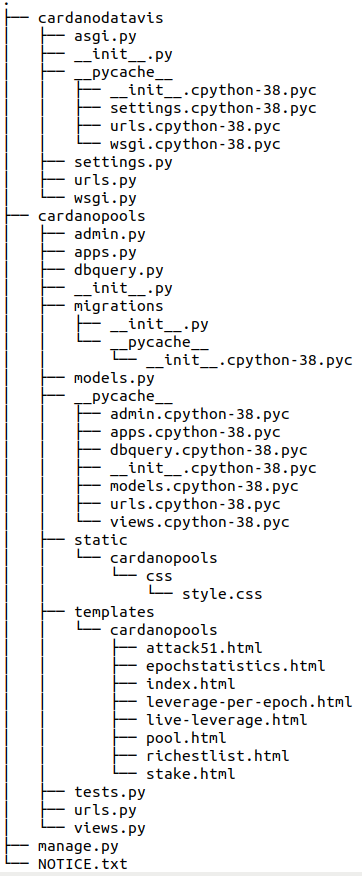

# README 

## PLEASE READ BEFORE EXAMINING THE CODE OF THIS DIRECTORY!

### This project was implemented in 2021 and it is an industry-related project.

#### Content of the project directory:

- db-queries.py (python3 file)
- Queries.pdf (pdf file)
- cardano-vis.py (python3 file)
- cardanodatavis (directory)
- plots (directory)

***
#### db-queries.py (python3 file)

This file contains most of the PostgreSQL queries used to create new tables to help us calculate the appropriate metrics for our analysis. It contains sql queries for current supply, total rewards per epoch, total pools per epoch, total stake and total pledge per epoch, heuristic grouping of pools using same ticker prefix, total stake and total pledge per group of pools per epoch, leverage of single pools and group of pools per epoch, live pools, live pool operators, live delegators, live stake and pledge of pools, live leverage of single pools and groups of pools, and addresses and their balances. We create the necessary tables to store results of most of the queries in our analysis to have fast access to results.

There are also comments in the file which have been written to help readers understand what the queries compute, what is stored in the tables or what complex queries the views represent in the local Cardano database instance.

***
#### Queries.pdf (pdf file)

This pdf file contains most significant queries of our analysis with comments. The queries included are the queries which can be found in the python script called **db-queries.py**. Each of the queries have been written in many lines in this file to be more readable to people who want to check the logic of the PostgreSQL queries and therefore the logic of our heuristic techniques and our analysis.

There are also comments in the file which have been written to help readers understand what the queries compute, what is stored in the tables or what complex queries the views represent in the local Cardano database instance.

***
#### cardano-vis.py (python3 file)

This python script can be used to create the most significant plots of the calculated metrics of our analysis. This constitutes an easy way to produce plots, bar plots and histograms which show the computed metrics using the matplotlib library of python. 

It can be used by developers who have installed cardano-db-sync and have a local database instance of the Cardano database. They do not have to use the web application developed. 

***
#### plots (directory)

This directory contains all the plots produced by running **cardano-vis.py**. More specifically, it contains plot of median leverage per epoch, plot of 25th percentile leverage per epoch, 75th percentile of leverage per epoch, bar plots for 51% attacks, plot of over-saturated pools per epoch [after epoch 234], plot of rewards per epoch, total delegators per epoch, plot of total pools per epoch, plot of total stake per epoch, plot of ratio between total pools in groups and total pools per epoch, etc.

There are also comments to help readers understand the code included in this file.

***
#### cardanodatavis (directory)

This directory contains all the code of the web application we developed. For the web application development, we have used **Django**, a high-level Web Framework (https://www.djangoproject.com). The directory **cardanodatavis** contains a lot of files which are generated by Django Web Framework. Django can be used for free by developers (MIT License), so we used it to create a high-level web application for our industry-related project. We have made the appropriate changes in the settings and we have added all the code needed to start the web application. 

The structure of the directory is the following:

List of the files with the code we added/changed:

- **NOTICE.txt** : file which contains all the licenses of tools we used (MIT Licenses). Apart from Django, we have used Chart.js (https://www.chartjs.org/), dataTables (https://datatables.net/) and Bootstrap (https://getbootstrap.com/). All these tools can be utilized for free (MIT Licenses).
- **/templates/cardanopools** : directory which contains all the html templates we created to display the metrics. As it has already been stated, We have used Chart.js (https://www.chartjs.org/), dataTables (https://datatables.net/) and Bootstrap (https://getbootstrap.com/). We were allowed to use these tools as part of the industry-related project, so we could spend more time in sql queries, heuristic techniques and the computation of metrics which constituted the most significant part of the project. For tables of data we have used dataTables (https://datatables.net/) and for plots and bar plots we have used Chart.js (https://www.chartjs.org/).
- **/static/cardanopools/css/style.css** contains a simple style for the web application
- **dbquery.py**: file which contains methods to query the database.
- **views.py**: file which contains PostgreSQL queries and computations of metrics. This file and the **db-queries.py** file are the two most important files of the project. They contain all queries, heuristic techniques and computation of metrics, such as leverage per epoch, live leverage, and 51% attack.

    
